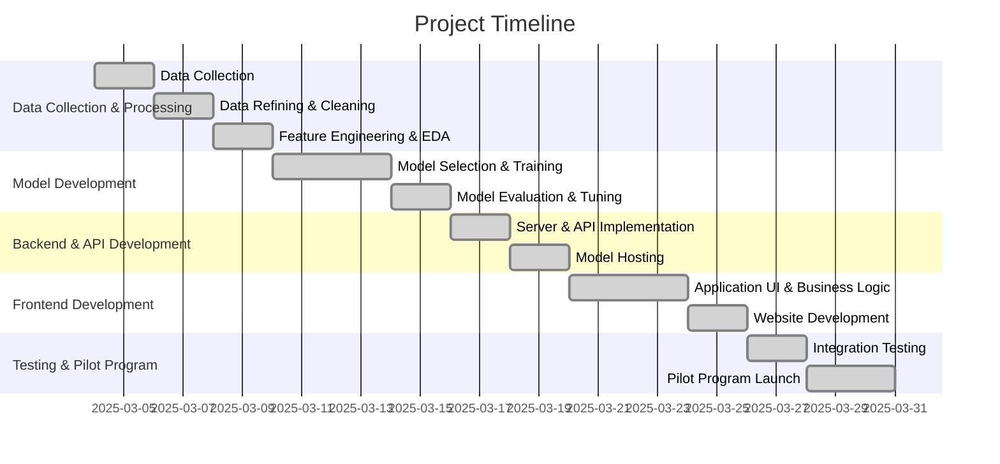
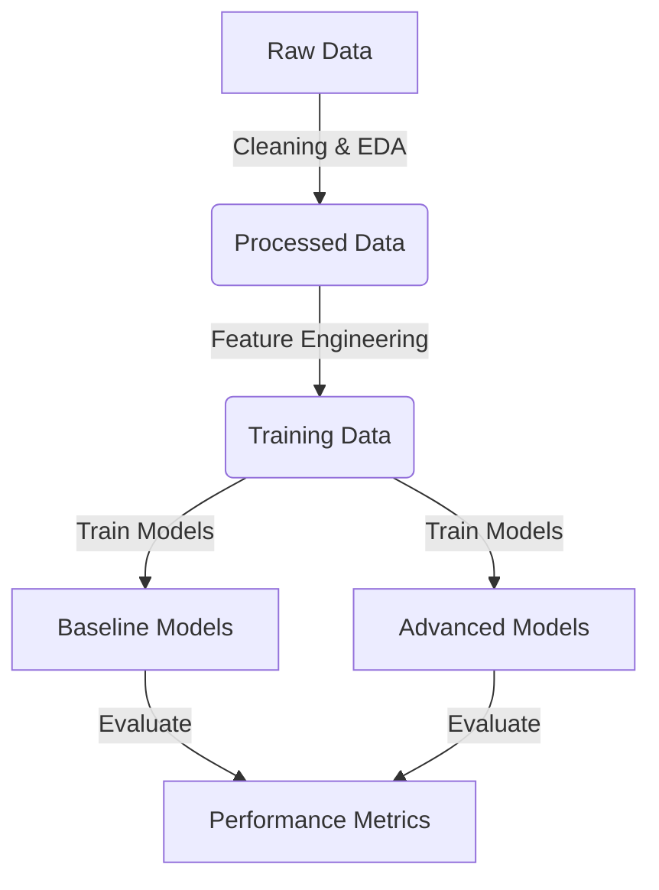
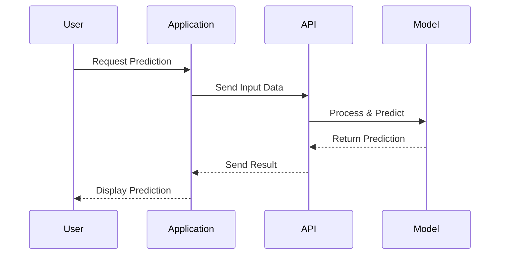
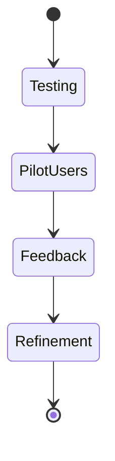

# Project Development Pipeline - 4-Week Implementation Roadmap

## Overview
**Goal:** Develop an AI-powered application with a model-driven backend, user interface, and website.

---

## Project Timeline

---

## Week 1: Data Collection & Processing
> Quality data is the foundation of an effective model.

### Tasks:
- Collect and organize relevant datasets
- Clean and preprocess data (handle missing values, outliers, normalization)
- Perform exploratory data analysis (EDA) and feature engineering

### Expected Outcomes:
- Refined dataset ready for model training
- Insights into feature importance

---

## Week 2: Model Development & Training
> Selecting the right model is crucial.

### Tasks:
- Choose initial model architectures
- Train multiple models and compare performance
- Fine-tune hyperparameters and optimize results

### Expected Outcomes:
- A trained, optimized model ready for deployment

---

## Week 3: Backend & Frontend Development
> A robust system ensures seamless interaction.

### Tasks:
- Implement backend server and API for model inference
- Develop frontend application UI and business logic
- Build a website for the project

### Expected Outcomes:
- Functional backend API
- User-ready frontend

---

## Week 4: Testing & Pilot Program
> Real-world testing ensures system reliability.

### Tasks:
- Conduct end-to-end integration testing
- Deploy system for pilot users
- Collect feedback and refine performance

### Expected Outcomes:
- A validated, deployable solution

---

## Final Deliverables
- Fully trained and hosted AI model
- API for interaction between client and server
- User-friendly application interface
- Informative project website
- Pilot program results and performance report

### Next Steps:
- Monitor and refine model based on feedback
- Scale system for broader deployment
- Expand feature set for improved user experience

> Building AI solutions with real impact. 🚀
